# Nutikas Restorani Reserveerimissüsteem

## 1 Projekti kokkuvõte

See on täisstack restoranide broneerimissüsteem.

**Backend**: Spring Boot REST API, JPA/Hibernate, H2 in-memory andmebaas

**Frontend**: Next.js 14 + React + TypeScript UI + Tailwind CSS + Framer Motion animatsioonid

**Peamised funktsioonid:**

* Laudade saadavuse otsing kuupäeva/kellaaja/inimeste arvu/ tsooni/ eelistuste järgi
* Intelligente soovitus- ja skoorimissüsteem laudadele
* Dünaamiline laudade liitmine suurematele seltskondadele
* Broneeringu loomise voog
* Admini autentimine ja parooli muutmine
* Admini saaliplaani redigeerimine
* Broneeringute haldusarmatuurlaud
* Automaatne broneeringute aegumine
* Välise API integratsioon (TheMealDB päevaprae soovitus)

**Tarkvara kvaliteet ja infrastruktuur:**

* Backend API testimine (unit- ja integratsioonitestid põhiloogika jaoks)
* Backend Docker-konteiner (ainult backend teenus)
* Osaline keskkonnapõhine konfiguratsioon (.env tugi backendis)
* Täisstack Docker orchestration puudub (frontend + backend + DB)
* Ei ole valmis tootmisvalmis konteineriseeritud lahendus (hindamise kontekst)

---

## 2 Tehnoloogiad

**Backend**

* Java 25
* Spring Boot 4.0.3
* Spring Data JPA
* H2 in-memory DB

**Frontend**

* Next.js 14.0.4
* React 18
* TypeScript
* Framer Motion + Tailwind CSS

**Konteiner**

* Multi-stage Docker build Dockerfile'is

---

## 3 Funktsioonide rakendamine

### 3.1 Broneeringu otsing ja filtreerimine

Kasutajad saavad otsida vabu laudu:

* Kuupäeva järgi
* Kellaaja järgi
* Inimeste arvu järgi
* Tsooni valiku järgi
* Eelistuste järgi

#### Rakendatud tsoonid (4)

* Peasaal
* Terrass (sisaldab laste mängunurka)
* Veranda
* Privaatruum

#### Rakendatud eelistused (3)

* Akna all
* Vaikne nurk
* Laste mängunurga lähedal

#### Eelistuste piirangud

Realistliku restorani loogika peegeldamiseks:

* "Vaikne nurk" ja "Laste mängunurga lähedal" ei saa olla valitud samaaegselt
* Ühe valimine keelab teise
* "Akna all" saab kombineerida mõlema eelistusega

See vältab vastuolulisi paigutusi ja parandab soovituste kvaliteeti.

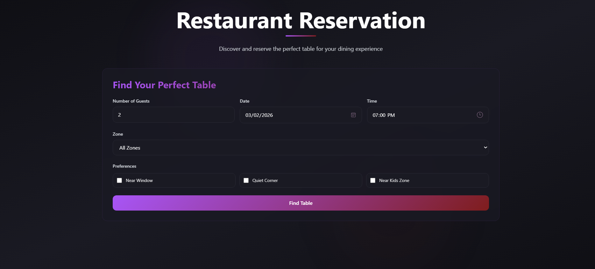

---

### 3.2 Soovitussüsteem ja skoorimine

Lihtsa filtreerimise asemel kasutatakse kaalutud skoorimissüsteemi.

Iga lauda hinnatakse järgmiste kriteeriumide alusel:

* Inimeste arvu sobivus
* Tsooni vastavus
* Eelistuste vastavus
* Paigutuse efektiivsus
* Saadavus

#### Efektiivsuse reegel

Väikesed seltskonnad ei istutata suurtele laudadele, kui väiksemaid laudu on saadaval.

Näide:

* 1-3 inimest ei saa 8-10 kohalisele lauale, kui 2-kohaline laud on vaba.

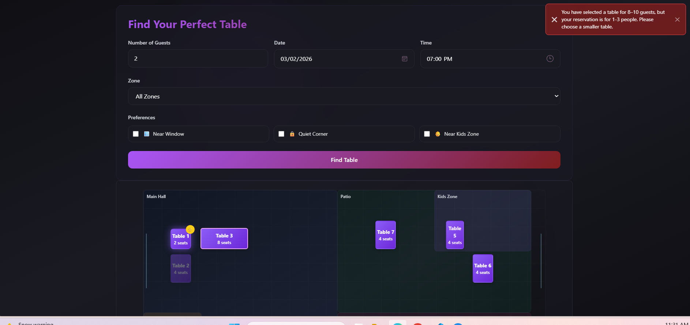

#### Visuaalne soovitussüsteem

Lauad kuvatakse erinevate olekutena:

* Saadaval
* Hõivatud
* Soovitatud
* Valitud

Soovitatud lauad:

* On eredamad
* Näitavad täheikooni
* Paistavad visuaalselt esile

Mitte sobivad ja hõivatud lauad jäävad nähtavaks, kuid tuhmid.

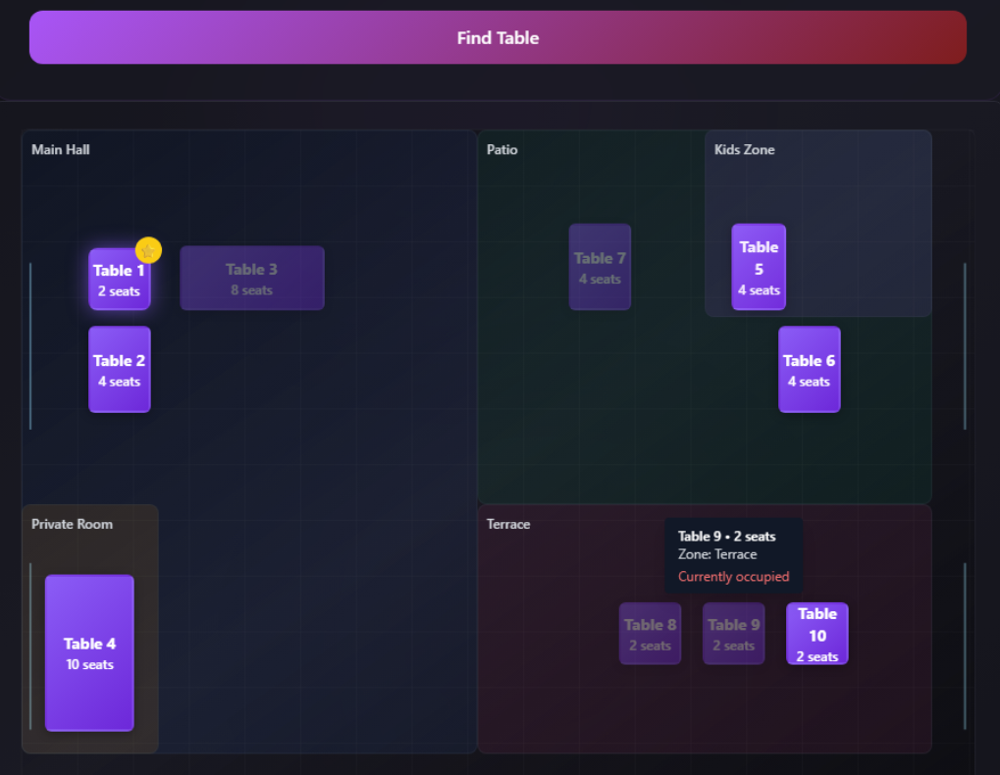

---

### 3.3 Dünaamiline laudade liitmine

Kui üks laud ei sobi suuremale seltskonnale:

* Kõrvuti lauad samas tsoonis saab liita
* Näide: 4 inimest terrassil → kaks 2-kohalist lauda
* Tsooni vahetus tühistab eelmised valikud

See täidab ülesande nõude dünaamiliseks liitmiseks.

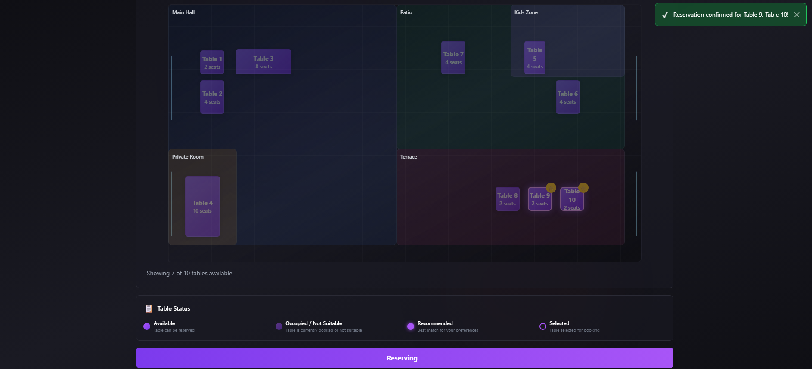

---

### 3.4 Automaatne hõivatussimulatsioon

Realistliku restorani simulatsiooniks:

* Kui valitud ajal broneeringuid pole
* 1–2 lauda märgitakse juhuslikult hõivatuks

Lisaks:

* Broneeringud aeguvad automaatselt 2 tunni pärast
* Aegunud broneering vabastab laua

---

### 3.5 Visuaalne saaliplaan

Restorani paigutus on täielikult interaktiivne.

Hiirega laua kohal olles kuvatakse:

* Tsoon
* Kohtade arv
* Saadavus
* Aknapõhine omadus
* Eelistuste sobivus

Täiendavad UI omadused:

* Aknajooned on kujutatud õhukeste siniste joontega
* Reaalajas saadavuse loendur:

  > "Näidatakse 8/10 lauda saadaval"

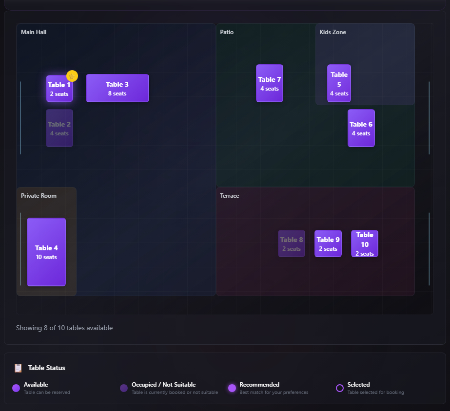

---

### 3.6 Admini liides

Lihtsustatud admin süsteem sisaldab:

* Parooli-põhine autentimine
* Parooli muutmine
* Laudade lohistamine ja paigutuse muutmine
* Broneeringute haldus:

  * Tänased
  * Viimase 7 päeva
  * Tulevased
* Broneeringute kustutamine

Märkus: Saaliplaan lähtestub täieliku uuesti laadimise korral, kuna kasutatakse in-memory andmebaasi.

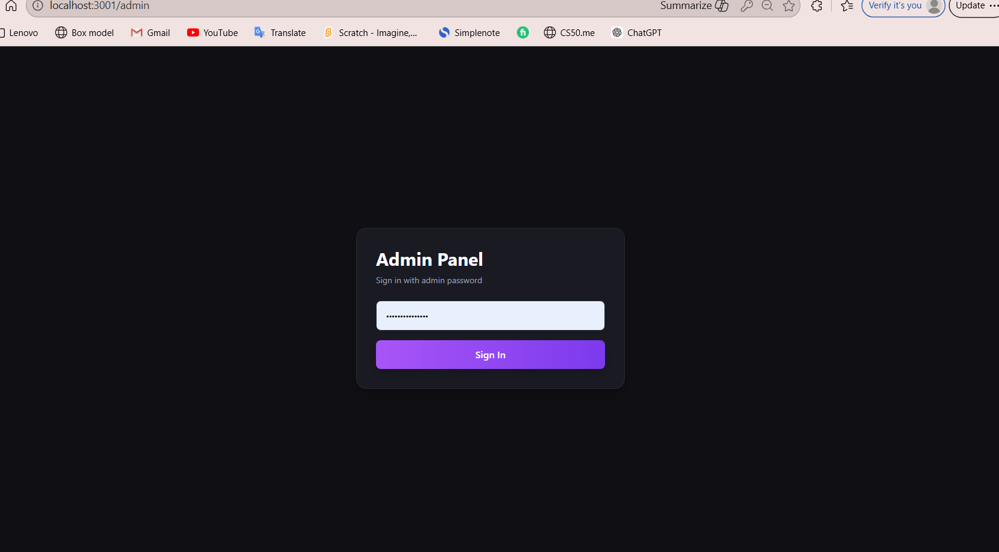

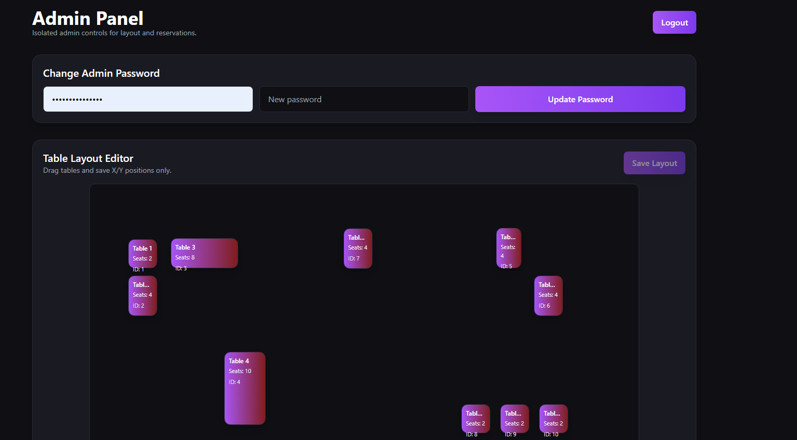

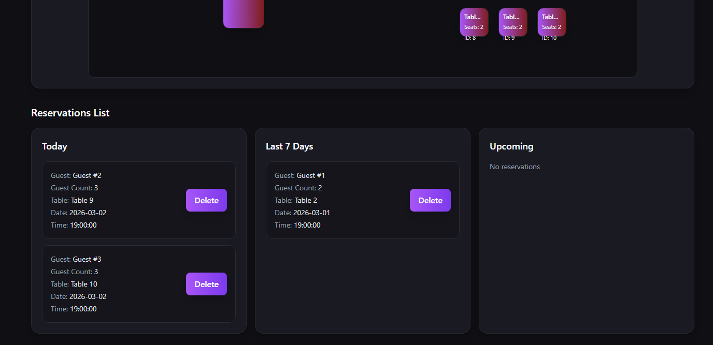

#### Laudade lohistamine

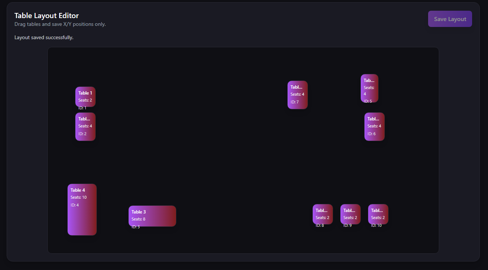

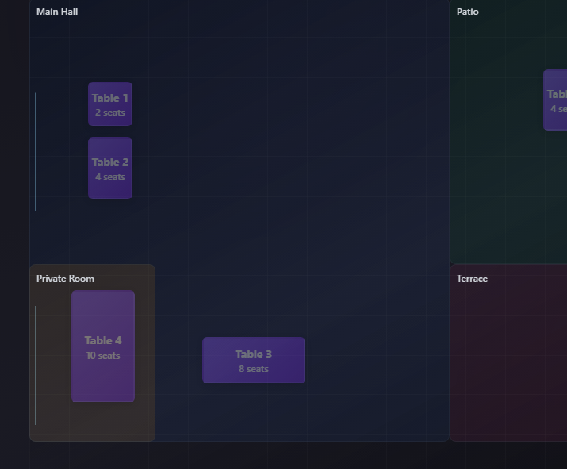

---

### 3.7 Välise API integratsioon

Süsteem integreerub TheMealDB avaliku API-ga.

Broneeringu kinnitamisel:

* Kuvatakse päevaprae soovitus
* Erinevad soovitused võivad ilmuda vastavalt päringule

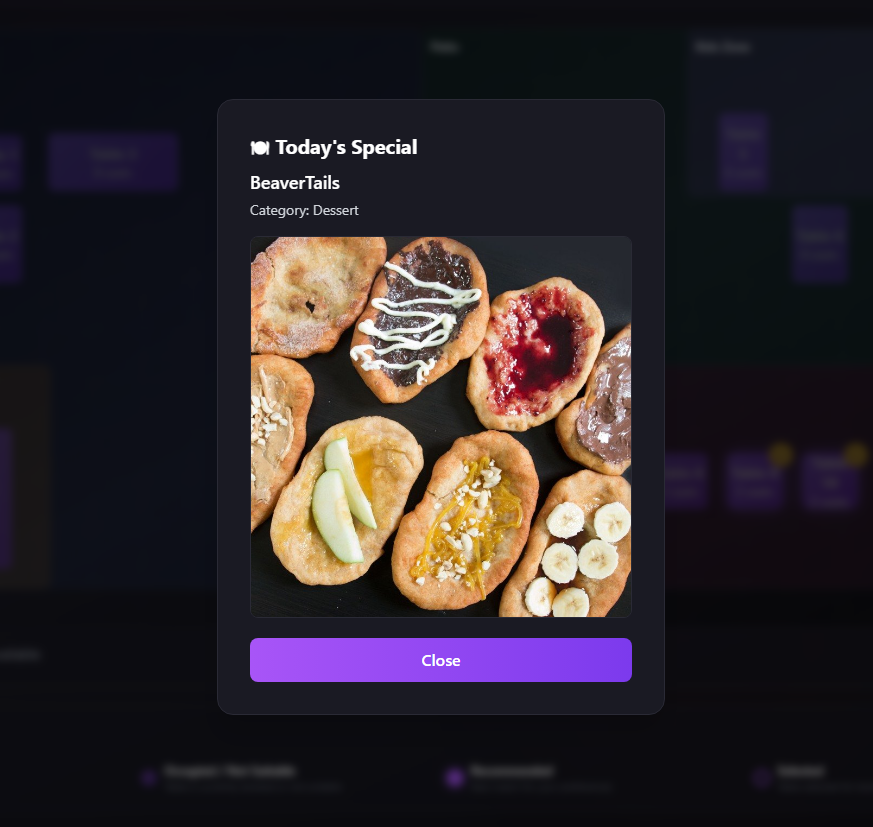

---

## 4 Käivitamine (hinnetaja jaoks)

### Eeltingimused

* Java 25 installeeritud
* Maven (`mvn -v`)
* Node.js + npm
* Vabad pordid: 8081 (backend), 3001 (frontend)

### A. Backend käivitamine

```bash
cd backend
mvn -DskipTests clean package
java -jar target/restaurant-booking-0.0.1-SNAPSHOT.jar
```

**Kontrolli:**

* [http://localhost:8081/tables](http://localhost:8081/tables)
* [http://localhost:8081/h2-console](http://localhost:8081/h2-console)

### B. Frontendi käivitamine

```bash
cd frontend
npm install
# PowerShell
$env:PORT=3001; npm run dev
```

**Kontrolli:**

* [http://localhost:3001](http://localhost:3001)
* [http://localhost:3001/admin](http://localhost:3001/admin)

### C. Admini sisselogimine

* Vaikimisi parool backend konfiguratsioonist:

  * `ADMIN_PASSWORD` keskkonnamuutuja (kui määratud)
  * Vastasel juhul fallback: `RestoAdmin!2026`

### D. Valikuline Docker Backend

```bash
docker build -t restaurant-backend .
docker run --rm -p 8081:8081 restaurant-backend
```

**Kontrolli:** [http://localhost:8081/tables](http://localhost:8081/tables)

---

## 5 Probleemid / Märkmed

### Next.js käivituse viga

```
Cannot find module './73.js'
```

Põhjus:

* Stale `.next` chunk cache kuumalaadimise ajal

Lahendus:

* Surma kõik Node protsessid
* Kustuta `.next`, `.turbo`, `.cache`
* Käivita server uuesti

---

### Spring Boot jooksu ebastabiilsus

`mvn spring-boot:run` ei olnud stabiilne

Lahendus:

* Build JAR
* Käivita `java -jar`

---

## 6 Abi / Viited

* AI tööriistu (GitHub Copilot / GPT-workflow) kasutati:

  * Next.js chunk cache probleemide lahendamiseks
  * Koodi refaktoreerimiseks ja kahekeelsete kommentaaride jaoks
  * Runtime vea silumiseks
  * Refaktorimissoovituste genereerimiseks
  * Boilerplate genereerimiseks
  * Dokumentatsiooni loomisel ja grammatika täiendamisel
  * Pikki väliseid koodijuppe ei kopeeritud; välised näited on märgitud kommentaarides

Kõik AI genereeritud koodid on üle vaadatud ja muudetud. Lõplik loogika ja testimine tehtud käsitsi.

---

## 7 Lahendamata / Riskipiirkonnad

* **Next.js chunk cache probleemid** võivad uuesti ilmneda
  Soovitus: ühe käsuga puhastus, üks dev server

* **Spring Boot `run` vead**
  Soovitus: kinnita JDK/Maven versioonid, vajadusel fallback JAR

---

## 8 Eeldused

* Hinnetaja käivitab backend ja frontend lokaalselt
* Pordid: 8081 (backend), 3001 (frontend)
* H2 in-memory DB sobib hindamiseks
* Admini autentimine konfiguratsiooniparooliga on piisav

---

## 9 Kulutatud aeg (hinnanguline)

| Ülesanne                               | Aeg     |
| -------------------------------------- | ------- |
| Frontend/admin paigutus ja pariteet    | ~16–18h |
| Backend testid + API kohandused        | ~10–12h |
| Docker ja käivitamise kontroll         | ~2h     |
| Runtime silumine (Next.js chunk/cache) | ~4h     |
| Kahekeelne dokumentatsioon             | ~1–2h   |
| Projekti dokumentatsioon               | ~4–5h   |
| **Kokku:**                             | 35–45h  |

---

## 10 Arendusprotsess

* Iteratiivne funktsioonipõhine arendus
* Milestone commit’id peamiste arhitektuurimuudatuste jaoks (Docker tugi, testikihi loomine, UI stabiliseerimine)
* Refaktorimiscommit’id eraldi funktsioonidest, kui võimalik
* Git on peamine versioonikontroll ja inkrementaalne valideerimine
